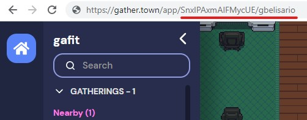

# gather-npc

A Gather NPC with some automatic functions and chat controls, built with the [Gather Websocket API](https://gathertown.notion.site/Gather-Websocket-API-bf2d5d4526db412590c3579c36141063) and based on [twitch-plays-gather](https://github.com/gathertown/twitch-plays-gather).

This is a Heroku-ready project. The instructions for configuring it are below 

## What can you do with the NPC

#### Automatic functions
- greet when someone joins
- take note of the birthdays
- lets everyone know when it's someone's birthday

#### Chat controls
- move it up/down/left/right
- make it dance/shoot confetti
- make it follow you around
- make it teleport to where you stand
- make it tell you who's having a birthday today
- make it tell you your horoscope of the day
- make it tell you anime quotes, inspirational quotes, random facts and jokes (option to disable NSFW jokes)
- make it send you the NASA's Astronomy Picture of the Day

## Things you'll need

- [Gather API key](https://gather.town/apiKeys) (login with a different email to create an account for the NPC, or it will join as you)
- [NASA API key](https://api.nasa.gov/#signUp) (this key optional, used only for the NASA's Astronomy Picture of the Day)
- Get the space's id:

## Development setup

Prerequisites: have NodeJS, npm and Postgres installed

Run `npm install`

Use the .env.example file create your .env file, placing you keys and configurations

### Running

`npm run start`

## Heroku setup

under construction, please hang on :)

## Credits
Full credit list [here](CREDITS.md)

## Donation
If you liked this project, you can buy me a cup of coffee (or beer) 😊

